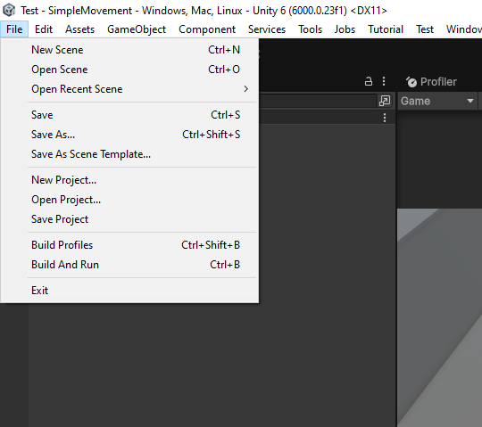
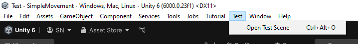
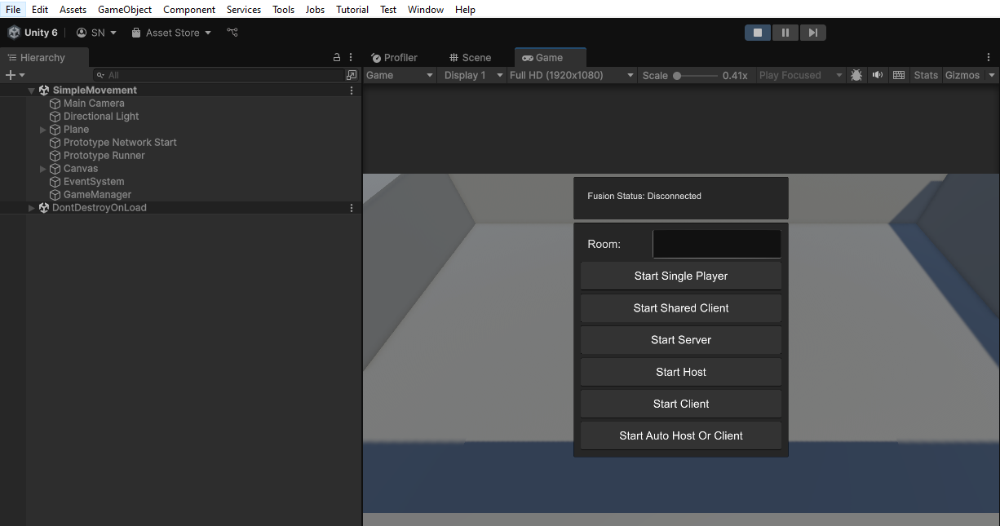
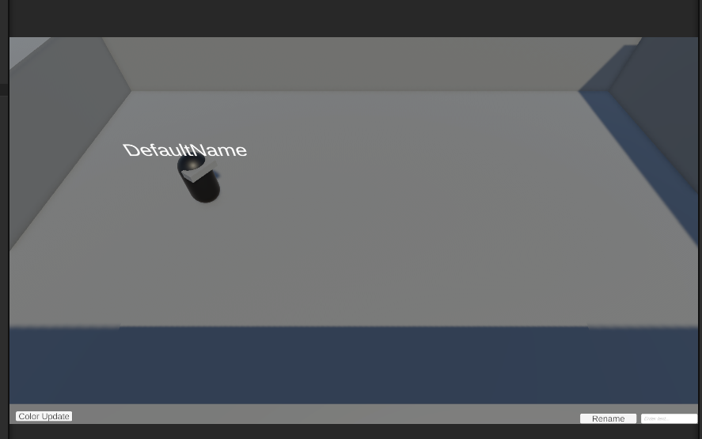
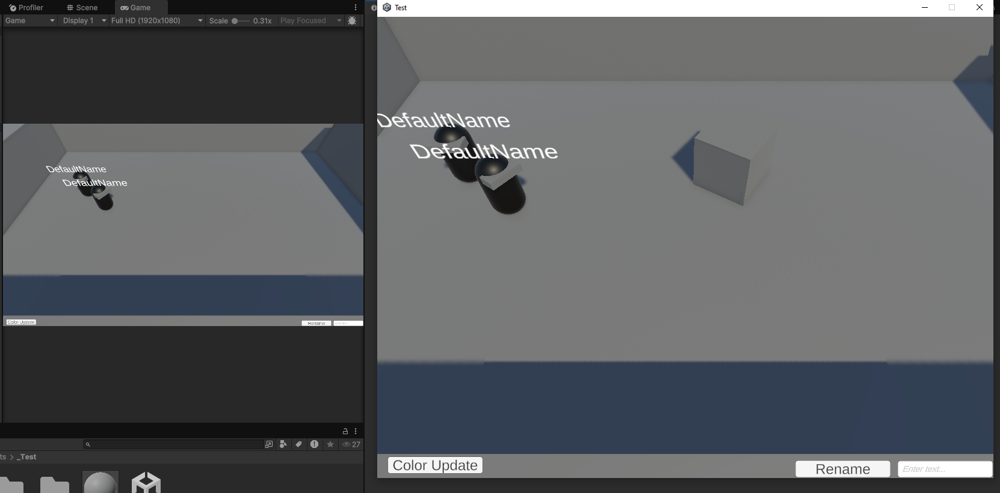
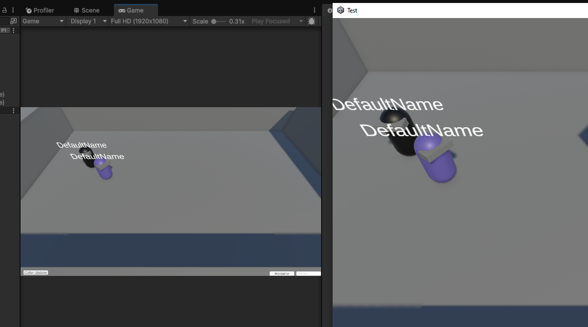
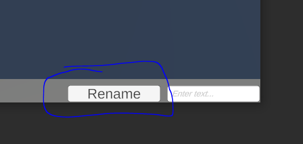
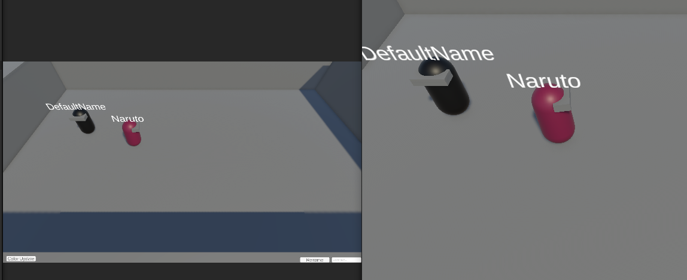

### How to run the Test?

#### Build the game (for multiplayer feature)

#### Open Scene Test
Open SimpleMovement scene (search for its in "Assets/_Test/SimpleMovement.unity") or click Open Test Scene (in Toolbar/Test/)

#### Run the game in Unity and standalone build

You would see a UI like this. Hit on **Start Shared Client**:

Then you would see your character with a sample skin color & nickname like below:

If you run both the stanalone file (the build) and the Editor, you should see something like below (two players appear in the same worldspace)

In case two players not see each other, exit the scene and replay would help! Sometime two clients couldn't find each other in Shared Mode so you would like to restart the scene/game several time.

Now, you can test basic features such as Movement, Sprint, Jump, ...

### Multiplayer Feature

#### Update color skin

Hit the button "Color update" to see skin color of your character be randomized, at the sametime, the color would be updated in another client

#### Update Nickname

Type to the textbox at the bottom right the name you want, then hit "Rename" 

The new name would appear at both clients

### Packages In Use
Fusion 2 and Fusion add-on
SisyphusFramework (my custom library, for Singleton in GameManager)
Using New Unity Input System
Using Unity 6000

### Extra
The HR did told me to make sure the project can be opened for Macbook. Unfortunately, I have only Window Machine. I did set the Platform to Window, Mac, Linux. Hope it helps.
