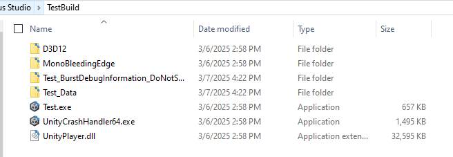

# TEST3d

This is a demo created in Unity engine that includes:
- A basic 3d scene and a controllable character
- Simple top-down-view Camera
- Simple movement with Jump and Sprint mechanics and standard W-A-S-D key
- Multiplayer features in Fusion 2 (Shared Mode).
  
## Table of Contents

- [Features](#features)
- [Setup Instructions](#setup-instructions)
- [Testing the Project](#testing--gameplay)
- [Package in Use](#packages-in-use)


## Features
- **Real-time Multiplayer:** Seamless networking using Photon Fusion 2 in Shared Mode
- **Third-Person Movement Mechanics:** Using W-A-S-D button to move and rotate character, using standard Shift Key and Space button to Sprint and Jump.
- **Multiplayer mechanic**: Allow each player to rename and change their in-game skin color. The name label and skin is updated realtime accross all connected devices
  
## Setup Instructions

Below are minimal steps to successfully reproduce the prototype and run its in your local Machine

### 1. Clone the Repository

```bash
git clone https://github.com/sonnguyen9800/TEST3d
cd TEST3d
```

### 2. Install Unity

Ensure you have [Unity](https://unity.com/) installed. This project was developed using Unity version 6000.0.23f1.

### 3. Open the Project in Unity

1. Launch Unity Hub.
2. Click on the **"Open"** button.
3. Navigate to the cloned `TEST3d` directory and select it.
4. Unity will load the project; this may take a few moments.
	
### 4. Configure Photon Fusion

- Using Photon Fusion required unique app ID. You can create your own Id by make your own Photon account, create a Fusion application. The system will give you a specific `app_id`.
- Onced you have your Id, paste it in `Fusion Hub` from Unity Editor. You can open `Fusion Hub` by click on ```Tool -> Fusion -> Fusion Hub```. The image below gives clear instructions on where to find its.

- You can use my **Test App Id**: ```c92d726c-7f45-42e7-a125-f576bb7a3b4e```


That's basic to run the game demo. Below are details on how to try on & test the game features.

# Testing & Gameplay

### A. Setup Scene and Game executable file

#### 1. Build the game

To test the multiplayer functionality, it's must to have at least two clients ready to be connected in shared mode. One way to do that is to build the game and run its as stanalone game. The other client would be the built-in Unity Editor.


You can hit Build and Run (see the picture below) to start the build and run the game immediately. Select a destination for build folder. The build would take less than 1 minute. Below are a build folder after the build process take place



You can always start the game by start the ```Test.exe``` executable file.

#### 2. Open Scene Test

Onced the build is ready, you can start another client by running the demo scene directly inside Unity Editor.

Open SimpleMovement scene (search for its in ```Assets/_Test/SimpleMovement.unity```) or click Open Test Scene (in ```Toolbar/Test/```)


#### 3. Run the game in Unity and standalone build

In Unity Editor, onced you open the scene, hit **Play** button to run the scene.


In the stanalone build, run the ```Test.exe``` in your build folder to start the client.

#### 4. Start Game

Onced the game/scene has been played, you would see a UI like this. Hit on **Start Shared Client** to start `Fusion 2 Shared Mode`:


Then you would see your character with a default skin color & nickname like below:


If you run both the stanalone file (the build) and the Editor, you should see something like below (two players appear in the same worldspace)


In case two players not see each other, exit the scene and replay would help! Sometime two clients couldn't find each other in Shared Mode so you would like to restart the scene/game several time.


Now, you can test basic features such as **Movement**, **Sprint**, **Jump**, ...


### B. Testing Multiplayer Feature

A simple way to test character customization and synchronize this change would be a simple color skin update on character mesh.

#### Update color skin

Hit the button "Color update" to see skin color of your character be randomized, at the sametime, the color would be synchronized in all other clients


#### Update Nickname

Type to the textbox at the bottom right the name you want, then hit "Rename" 


The new name would appear at both clients


# Packages In Use
- **Unity 6000.0.23f1** - Unity Game Engine
- Use **Fusion 2** and **Fusion add-on** (to use *NetworkRigidbody3d*) to implement multiplayer feature. Also, I use built-in UI of Fusion to start the network.
- Use *SisyphusFramework* (my custom library, for Singleton in GameManager)
- Use **New Unity Input System** to handle input event from keyboard.
- **TextMeshPro** - Advanced text rendering.

# Extra
The HR did told me to make sure the project can be opened for Macbook. Unfortunately, I have only Window Machine. I did set the Platform to Window, Mac, Linux. Hope it helps.
